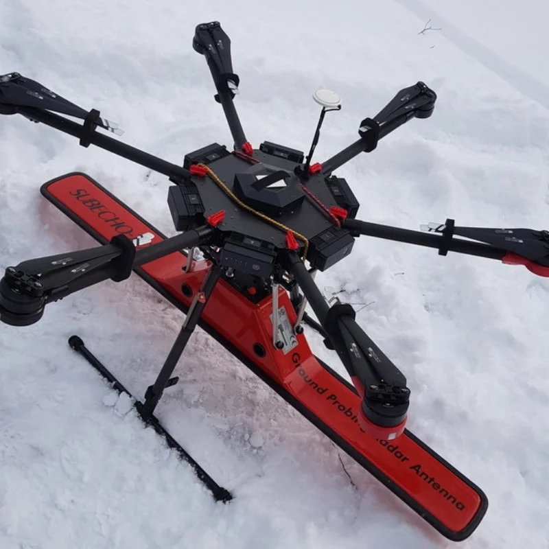
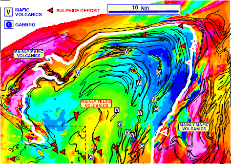

# Comment voir à travers le sol ?

Dans une étude géophysique, une forme d'énergie est transmise dans le sol ou dans la roche et des réponses à cette sollicitation sont mesurées. Les réponses dépendent des propriétés physiques du sol et de l'étude elle-même. Les données géophysiques peuvent être utilisées pour générer des images qui contiennent des informations géologiques et elles peuvent être traitées ultérieurement pour obtenir des informations sur la répartition des propriétés physiques recherchées ou d'un paramètre d'intérêt. La géophysique est donc utile si le lien entre le problème géologique ou d'ingénierie et la propriété physique est connu. Dans cette section, nous présentons quelques concepts et définitions fondamentaux sur les études géophysiques, les propriétés physiques, la terminologie et fournissons des exemples qui illustrent comment la géophysique peut être utilisée.

Dans l'exemple ci-dessous, nous pouvons voir une analogie entre l'imagerie médicale, ici illustrée à l'aide du patient Homer, et une imagerie géophyisque à l'aide d'ondes sismiques, à l'échelle de la Terre. Outre les différences flagrantes en termes de contenu, on peut noter les différences en termes de résolution, en termes de rapport signal sur bruit, en termes de connaissances a priori du milieu pour interpréter les images.

 
	
	Imagerie médicale d'Homer et tomographie sismique à l'échelle du globe.

## Introduction
### Sur l'importance d'étudier le sous-sol
La surface de la terre a servi de support à la plupart des activités humaines tout au long de l'histoire de la civilisation, et ces activités ont été profondément affectées par les caractéristiques largement invisibles du sous-sol environnant. Le développement humain a fortement dépendu des ressources obtenues à la fois près de la surface (comme pour les matériaux de construction) et à des centaines ou des milliers de mètres de profondeur (comme pour les minerais métallifères et les produits pétroliers). Nous utilisons l'eau des aquifères souterrains et celle-ci est en intéraction permanente avec les différents composants de notre environnement (océan, rivière, lac), nous déposons une grande partie de nos déchets dans le sous-sol et construisons des structures qui doivent être en interaction avec le sous-sol en toute sécurité. 
### Propriétés physiques et roches
Par rapport à ces différentes activités, les caractéristiques du sous-sol présentant un intérêt particulier comprennent la position, la répartition et la structure des différents types de roches, la distribution de la taille des grains, la résistance mécanique de la roche, la porosité ou encore la perméabilité des matériaux rencontrés. La complexité inhérente à la Terre peut rendre difficile, voire impossible, de déduire ces caractéristiques à partir d'une observation directe. Par conséquent, elles doivent souvent être déduites à partir de propriétés physiques plus "fondamentales" telles que la densité, la conductivité électrique, l'impédance acoustique et autres. Ces propriétés fondamentales peuvent être mesurées par des études géophysiques qui enregistrent la réponse de la Terre à divers types de signaux naturels ou artificiels. Le tableau suivant énumère quelques propriétés physiques et des matériaux et/ou structures géologiques auxquels elles sont souvent associées, ainsi que les méthodes géophysiques qui peuvent cartographier dans l'espace les variations de ces propriétés physiques. 

|Propriété physique  | Utile pour | Méthodes géophysiques associées |
| ------------- | ------------- |------------- |
| Résistivité électrique | Contenu en eau  | Tomographie de résistivité électrique  |
| Susceptibilité magnétique  | Minerais de fer  | Prospection magnétique  |
| Masse volumique  | Cavité  | Gravimétrie  |
| Module d'élasticité volumique  | Géotechnique  | Sismique réfraction  |

D'autres propriétés physiques utiles peuvent être cartographiées et que nous verrons à travers ce cours, notamment la chargeabilité ou la permitivité diélectrique.

### Un besoin de mieux modéliser le sous-sol

Les structures souterraines sont généralement interprétées soit en termes d'objets, de couches, d'éléments linéaires ou de distributions plus complexes. Ce type d'information, obtenu à distance et de manière non invasive par des méthodes géophysiques, est couramment utilisé dans l'ingénierie géotechnique et environnementale et pour l'exploration pour caractériser les structures géologiques, estimer les réserves de minerai ou encore détecter les panaches de contamination, etc. Qu'implique l'obtention de telles informations ? Tout d'abord, un travail de terrain est effectué, ce qui implique de nombreuses mesures minutieuses le long des lignes de levé au sol ou depuis un avion. Les interprétations de ces mesures peuvent être faites à partir de graphiques ou de cartes de données brutes ou traitées, ce qui permet d'obtenir des informations qualitatives ou grossièrement quantitatives sur les emplacements, les profondeurs et les types de matériaux sous terre.

 

	Un drone de terrain portant l'équipement d'acquisition géophysique (GPR) 
	pour voir sous la neige ou la glace (www.geo-matching.com). 

Cependant, pour répondre à une demande d'informations de plus en plus quantitatives, des techniques sophistiquées sont maintenant utilisées pour estimer numériquement la répartition spatiale voire spatio-temporelle des propriétés physiques de la Terre. Ces procédures de modélisation donnent aux ingénieurs et aux scientifiques un moyen plus efficace, plus fiable et plus précis d'extraire le plus d'informations possible des données de campagnes géophysiques. Elles permettent également de présenter les informations plutôt techniques de manière plus visuelle et plus pertinente aux gestionnaires, aux décideurs, aux organismes de réglementation et autres groupes d'intérêt. 

## Geophysics 101

Les études géophysiques sont effectuées lorsque l'on souhaite obtenir des informations sur le sous-sol de la terre, mais que l'échantillonnage direct par des techniques coûteuses et invasives telles que le forage ou le creusement de tranchées est insuffisant, peu pratique ou non recommandé. Une étude peut être aussi vaste que la Terre entière, aussi petite que les quelques premiers centimètres de la surface du sol, ou n'importe où entre les deux. 

### Mesurer les propriétés physiques

Lors d'une étude géophysique, de l'énergie, sous forme mécanique ou électrique par exemple, est injectée dans la terre et les réponses sont enregistrées à la surface, dans l'air ou dans des forages. Les données qui en résultent révèlent des informations sur la terre, car le comportement de l'énergie dans le sol est contrôlé par la répartition spatiale des propriétés physiques de la terre. Par exemple, une des propriétés physiques de base est la susceptibilité magnétique, qui décrit la capacité d'une roche à s'aimanter. Cette propriété physique fournit des informations sur le type et les structures des roches car la susceptibilité magnétique de la roche est directement liée au type de minéral, aux processus d'altération chimique. Une deuxième propriété physique importante est la conductivité électrique, qui quantifie la capacité d'un matériau à transporter un courant électrique. La figure 2 illustre une façon d'effectuer un levé géophysique pour fournir des informations sur la distribution de la conductivité électrique sous la surface.
 
 

De toute évidence, l'application de la géophysique aux problèmes liés au sous-sol terrestre est un processus non trivial et doit être menée selon la procédure en sept étapes.

### Interprétation traditionnelle

Traditionnellement, les informations utiles étaient extraites des résultats de terrain géophysique en examinant des cartes ou des profils linéaires de données d'enquête brutes ou filtrées. Ces images sont utiles pour estimer les emplacements et les quantités de matériaux enfouis, et pour aider à choisir des emplacements pour des techniques plus invasives (et coûteuses) telles que le forage. Par exemple, les cartes à grande échelle des données magnétiques ou gravimétriques montrent souvent la structure géologique, ou identifient une région anormale qui pourrait être associée à une cible souhaitée. À titre d'exemple, la figure 3 montre les données magnétiques acquises dans la région de Bathurst, au Nouveau-Brunswick. Les principales caractéristiques observées sont liées à la structure géologique. 

 

	Figure 3. Antiforme Tetatouche - Champ magnétique total, tiré de "Airborne Geophysical Survey of the Bathurst Mining Camp", site web de la Commission géologique du Canada.

Historiquement, dans l'exploration minière, l'identification d'une région anormale était souvent le point final de l'analyse, et l'image était utilisée pour planifier l'emplacement d'un trou de forage. Malheureusement, le taux de réussite était généralement faible. Au mieux, les cartes de données fournissent quelques informations sur l'étendue latérale d'un corps, mais peu sur ce qui se passe en profondeur. Une analyse quantitative, en particulier l'inversion, est nécessaire pour obtenir des informations en 3D.

### Inversion

 .. figure: : ../images/inv-cartoon.jpg
	:align : center
	échelle : 90

Le but du problème inverse est de trouver un modèle mathématique de la terre qui a produit les observations sur le terrain. C'est-à-dire "quelle est la distribution des propriétés physiques du sous-sol à l'origine des données observées à la surface ?" Les premières solutions d'inversion consistaient à caractériser la terre par quelques prismes ou couches et à trouver les propriétés géométriques et physiques de ces modèles simplifiés de la terre. 

En raison de l'extrême complexité de la terre, les modèles utiles doivent souvent avoir de nombreux paramètres, généralement plus que le nombre de données. Cela signifie que le problème de trouver un modèle (c'est-à-dire d'estimer les valeurs de chaque paramètre) est un problème dans lequel il y a plus d'inconnues que de données. De tels problèmes n'ont pas de solutions uniques, et cette non-unicité est exacerbée lorsque les données sont bruyantes ou inexactes. Les méthodes formelles d'inversion permettent de résoudre ces problèmes en utilisant des techniques mathématiques bien définies. Une annexe explique l'inversion de manière un peu plus détaillée. 

Certains avantages de l'application d'une inversion rigoureuse peuvent être constatés en comparant les cartes traditionnelles et les pseudo-coupes des données brutes aux informations des modèles 3D et 2D obtenus par inversion.  macos/deepLFree.translatedWithDeepL.text

## Un exemple concret : Westhoek

## Un exemple analytique : la sismique réfraction pour la géotechnique

## Conclusions
