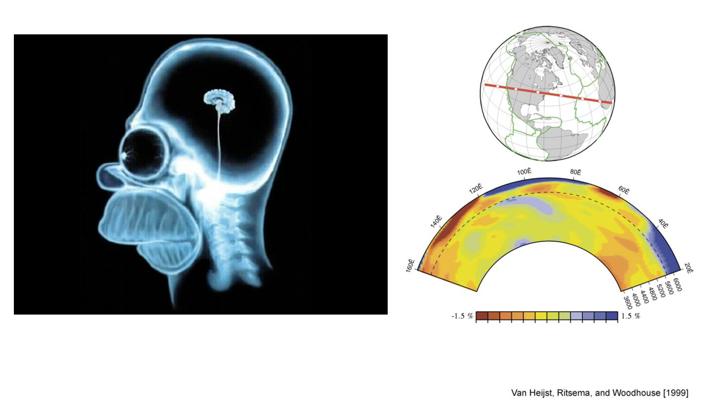

# Comment voir à travers le sol ?

Dans une étude géophysique, une forme d'énergie est transmise dans le sol ou dans la roche et des réponses à cette sollicitation sont mesurées. Les réponses dépendent des propriétés physiques du sol et de l'étude elle-même. Les données géophysiques peuvent être utilisées pour générer des images qui contiennent des informations géologiques et elles peuvent être traitées ultérieurement pour obtenir des informations sur la répartition des propriétés physiques recherchées ou d'un paramètre d'intérêt. La géophysique est donc utile si le lien entre le problème géologique ou d'ingénierie et la propriété physique est connu. Dans cette section, nous présentons quelques concepts et définitions fondamentaux sur les études géophysiques, les propriétés physiques, la terminologie et fournissons des exemples qui illustrent comment la géophysique peut être utilisée.

Dans l'exemple ci-dessous, nous pouvons voir une analogie entre l'imagerie médicale, ici illustrée à l'aide du patient Homer, et une imagerie géophyisque à l'aide d'ondes sismiques, à l'échelle de la Terre. Outre les différences flagrantes en termes de contenu, on peut noter les différences en termes de résolution, en termes de rapport signal sur bruit, en termes de connaissances a priori du milieu pour interpréter les images.

 

## Introduction

+-------------------------------------------+-------------------------------------------------+
| Common physical properties                | Associated geophysical survey techniques        |
+===========================================+=================================================+
| Electrical resistivity (or conductivity)  |  DC resistivity, all electromagnetic methods    |                    
+-------------------------------------------+-------------------------------------------------+
| Magnetic susceptibility                   |  All magnetic survey methods                    |
+-------------------------------------------+-------------------------------------------------+
| Density                                   |  Gravity, and seismic reflection or refraction  |
+-------------------------------------------+-------------------------------------------------+
| Acoustic wave velocity                    |  Seismic reflection or refraction               |
+-------------------------------------------+-------------------------------------------------+

## Geophysics 101

## Un exemple concret : Westhoek

## Un exemple analytique : la sismique réfraction pour la géotechnique

## Conclusions
